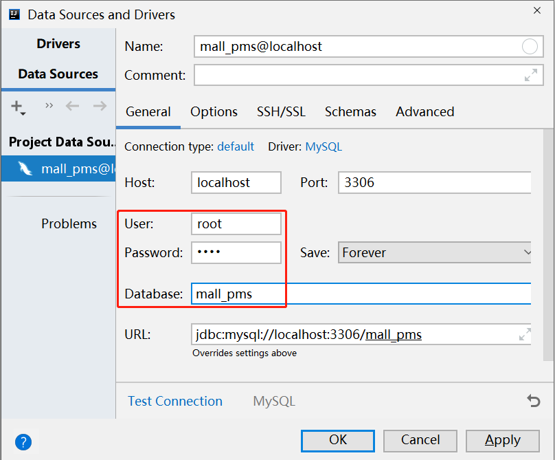

# 第四阶段

项目：酷鲨商城运营管理平台（前端项目 + 后端项目）

老师：成恒

后端项目参考地址：https://gitee.com/chengheng2022/csmall-server-repo.git

前端项目参考地址：https://gitee.com/chengheng2022/csmall-client-repo.git

# 数据库设计

## 商品数据库

数据表设计原则：

- 自动编号的ID应该设计为`bigint`，因为`int`可能不够用，并且，为了便于统一管理，建议所有表的自增ID全部使用`bigint`
- 数值类型的字段使用`unsigned`表示“无符号位的”，以`tinyint`（对应Java中的`byte`类型）为例，如果是有符号位的，取值区间是`[-128, 127]`，如果是无符号位的，取值区间是`[0, 255]`，需要注意，在许多设计中，添加`unsigned`更多的是为了表现“语义”，并不是为了扩容正数的取值上限
- 强烈推荐为每个字段配置`COMMENT`，以表示各字段的含义
- 使用`varchar`时，应该设计一个绝对够用的值，例如“用户名”可以设计为`varchar(50)`，`varchar`是变长的，只会占用实际存入的数据的应占用空间，即使设计得比较大，也不会浪费空间，但是，也不要大到离谱，会影响语义
- 如果你可能需要根据某个字段进行排序，而这个字段可能存在“非ASCII字符”（例如中文），应该添加新的字段，记录对应的数据的拼音，实际排序是，应该根据拼音字段排序，以解决中文的多音字问题

- 许多数据都可能需要注意列表中的数据的顺序，则极可能需要添加“排序序号”字段，以干预排序结果
  - 在编写查询的SQL语句时，只要查询结果可能超过1条，必须显式的指定`ORDER BY`，如果第1排序规则不足以使得所有结果都有明确顺序，还应该继续指定第2排序规则、第3排序规则等

- 当设计有“层级”特征的数据表时，例如设计“类别表”、“省市区数据表”时，可以在表中设计`parent_id`（或类似名称）的字段，使得1张表可以存储若干层级的数据
- 当某些数据的量比较大时，可能需要与别的数据关联起来，在实际应用时，可以起到“筛选”的作用，例如：当发布“笔记本电脑”这种类别的商品时，不需要将“老干妈”这种名牌显示在列表中
- 如果某张表中某个字段的值可能比较大，应该将这个字段设计到另一张表中去，并且，这2张表将形成“1对1”的关系，例如“新闻”数据中的“正文”就是可能比较大的数据，则应该拆分为“新闻信息表”和“新闻正文表”，将新闻的正文数据保存在“新闻正文表”中，而新闻的其它基本信息都保存在“新闻信息表”中即可，这种拆分的目的是为了避免较大的数据影响查询效率
- 对于数据量可能非常大的表，可能后续将会做分库分表的处理，主键ID不要使用自动编号

电商平台的商品设计：

- SPU（Standard Product Unit），标准商品单元，不包含商品的分支型号参数，例如某个手机的SPU数据将不包含手机的颜色、内存容量等，但包含品牌、类别这种各型号都相同的数据
- SKU（Stock Keeping Uint），持久库存单元，是基于SPU基础之上的数据，例如基于某个手机的SPU，在此基础上扩展出手机的颜色、内存容量等，它是真正可售卖的

# 创建项目

本项目是一个聚合项目的结构，首先，创建父级项目，项目参数如下：


在选择Spring Boot版本并勾选依赖项的界面，只需要随便选一个Spring Boot版本即可，依赖项后续会手动添加，至此，父项目创建完成。

当创建完成后，删除此项目的`src`文件夹，并调整`pom.xml`文件，如下：

```xml
<?xml version="1.0" encoding="UTF-8"?>
<project xmlns="http://maven.apache.org/POM/4.0.0" xmlns:xsi="http://www.w3.org/2001/XMLSchema-instance"
         xsi:schemaLocation="http://maven.apache.org/POM/4.0.0 https://maven.apache.org/xsd/maven-4.0.0.xsd">

    <!-- 模块版本，是相对固定的取值 -->
    <modelVersion>4.0.0</modelVersion>
    <packaging>pom</packaging>
    <modules>
        <module>untitled</module>
    </modules>

    <!-- 父级项目，其实，每个基于Spring Boot的项目，都应该是spring-boot-starter-parent的子项目 -->
    <!-- 本次建议使用 2.5.x 系列的版本 -->
    <parent>
        <groupId>org.springframework.boot</groupId>
        <artifactId>spring-boot-starter-parent</artifactId>
        <version>2.5.0</version>
        <relativePath/> <!-- lookup parent from repository -->
    </parent>

    <!-- 当前项目的信息 -->
    <groupId>cn.tedu</groupId>
    <artifactId>csmall-server</artifactId>
    <version>0.0.1</version>

    <!-- 属性配置 -->
    <!-- 可以自定义所需的配置 -->
    <properties>
        <java.version>1.8</java.version>
        <spring-boot.version>2.5.0</spring-boot.version>
    </properties>

    <!-- 依赖管理 -->
    <!-- 配置在此标签下的各依赖，不会被各子项目继承 -->
    <!-- 依赖管理主要是管理各依赖项的版本，各项目添加此处配置的依赖项时不必指定版本号 -->
    <dependencyManagement>
        <dependencies>
            <!-- Spring Boot的基础依赖项 -->
            <dependency>
                <groupId>org.springframework.boot</groupId>
                <artifactId>spring-boot-starter</artifactId>
                <version>${spring-boot.version}</version>
            </dependency>
            <!-- Spring Boot测试的依赖项 -->
            <dependency>
                <groupId>org.springframework.boot</groupId>
                <artifactId>spring-boot-starter-test</artifactId>
                <version>${spring-boot.version}</version>
            </dependency>
        </dependencies>
    </dependencyManagement>

    <!-- 当前项目使用的依赖项 -->
    <!-- 在父项目中配置的依赖项，各子项目均可以直接继承得到，即：子项目不需要添加这些依赖 -->
    <dependencies>
    </dependencies>

</project>
```

完成后，对父级项目点击鼠标右键，选择`New` > `Module`以创建子级项目模块，先创建`csmall-product`，它是用于处理商品数据管理的：


关于这个子项目，主要配置：

- 使用`csmall-server`作为父项目
- 添加依赖项

具体配置为：

```xml
<?xml version="1.0" encoding="UTF-8"?>
<project xmlns="http://maven.apache.org/POM/4.0.0" xmlns:xsi="http://www.w3.org/2001/XMLSchema-instance"
         xsi:schemaLocation="http://maven.apache.org/POM/4.0.0 https://maven.apache.org/xsd/maven-4.0.0.xsd">

    <!-- 模块版本，是相对固定的取值 -->
    <modelVersion>4.0.0</modelVersion>

    <!-- 父级项目 -->
    <parent>
        <groupId>cn.tedu</groupId>
        <artifactId>csmall-server</artifactId>
        <version>0.0.1</version>
        <relativePath/> <!-- lookup parent from repository -->
    </parent>

    <!-- 当前项目的信息 -->
    <groupId>cn.tedu</groupId>
    <artifactId>csmall-product</artifactId>
    <version>0.0.1</version>

    <!-- 当前项目使用的依赖项 -->
    <dependencies>
        <!-- Spring Boot的基础依赖项 -->
        <dependency>
            <groupId>org.springframework.boot</groupId>
            <artifactId>spring-boot-starter</artifactId>
        </dependency>
        <!-- Spring Boot测试的依赖项 -->
        <dependency>
            <groupId>org.springframework.boot</groupId>
            <artifactId>spring-boot-starter-test</artifactId>
            <scope>test</scope>
        </dependency>
    </dependencies>

    <!-- 构建项目的配置 -->
    <!-- 如果此处的配置报错，可以： -->
    <!-- 1. 删除报错的标签，因为，除非你需要将项目打包，否则，可以不需要此处的配置 -->
    <!-- 2. 显式的指定版本号可能可以解决报错的问题 -->
    <build>
        <plugins>
            <plugin>
                <groupId>org.springframework.boot</groupId>
                <artifactId>spring-boot-maven-plugin</artifactId>
            </plugin>
        </plugins>
    </build>

</project>
```

# 关于聚合项目

在聚合项目中，父级项目通常需要显式的配置：

```xml
<packaging>pom</packaging>
```

此标签的配置默认值是`jar`，各子项目保持默认即可，即子项目可以不配置此标签。

并且，在父项目中配置子级模块项目清单：

```xml
<modules>
    <module>csmall-product</module>
</modules>
```

# 关于依赖项的作用域

在配置依赖项时，可以通过`<scope>`指定此依赖项的作用域，例如：

```xml
<!-- Spring Boot测试的依赖项 -->
<dependency>
    <groupId>org.springframework.boot</groupId>
    <artifactId>spring-boot-starter-test</artifactId>
    <scope>test</scope>
</dependency>
```

关于`<scope>`的配置值：

- `test`：此依赖项仅用于测试，仅作用于`src/test`下的代码，并且，当项目编译打包时，不会被打包

# 数据库与数据表

先在终端中创建名为`mall_pms`的数据库：

```mysql
CREATE DATABASE mall_pms;
```

然后，在IntelliJ IDEA中配置Database面板：



然后，从完整版项目（csmall-server-repo）的`/doc/sql/mall_pms.sql`中找到创建数据表的SQL脚本，全部选择并粘贴到以上Database面板对应的Console中，然后执行，即可创建出各数据表：


使用同样的步骤，创建出名为`mall_ams`的数据库，并通过`mall_ams.sql`创建这个数据库中的各数据表。

# 项目的开发流程

当已经完成了数据库与数据表的设计之后，关于项目的开发，应该：

- 先了解所有数据表，分析各表的数据特征，应该先处理基础数据，再此基础之上，优先处理简单的数据

  - 先处理基础数据：例如必须先有品牌，才可以发布商品，则品牌就是商品的基础数据，在开发时，应该先处理品牌数据，再处理商品数据

  - 优先处理简单的数据：通常，数据关联较少、字段较少的数据，就是简单的数据

  - 在当前项目中，大致的顺序可以是（你也可以自行调整）：

    ```
    相册 > 品牌 > 类别 > 图片 > 属性模板 > 属性 > SPU > SKU
    ```

- 接下来，在处理每种数据时，大致遵循以下顺序：

  ```
  增 > 查 > 删 > 改
  ```

  以相册数据为例，开发顺序大致是：

  ```
  新增相册 > 查询相册列表 > 根据ID查询相册详情 > 根据ID删除相册 > 修改相册详情
  ```

- 在开发每个业务功能时，大致遵循的顺序是：

  ```
  Mapper > Service > Controller > 页面
  ```

  在新增相册为例，开发顺序大致是：

  ```
  AlbumMapper > AlbumService > AlbumController > 页面
  ```

# 添加数据库编程的依赖

在项目中实现数据库编程，至少需要添加：

- 数据库的依赖项，例如：`mysql-connector-java`
- 编程框架的依赖项，例如：`mybatis-spring-boot-starter`

先在`csmall-server`中实现依赖管理：


然后，在`csmall-product`项目的`pom.xml`中，添加以上依赖，添加时，不必指定版本号：


# 配置连接数据库的参数

当添加了数据库编程的依赖项后，在启动项目时，Spring Boot会自动获取连接数据库的配置参数值，如果没有配置，则会启动失败，例如：


则应该在项目中的`src/main/resources/application.properties`文件中添加配置：

```properties
spring.datasource.url=jdbc:mysql://localhost:3306/mall_pms?useUnicode=true&characterEncoding=utf-8&serverTimezone=Asia/Shanghai
spring.datasource.username=root
spring.datasource.password=root
```

由于Spring Boot在启动项目时，只会读取以上配置信息，并不会真正的连接数据库，所以，无法检验以上配置值是否正确！

可以在`src/test/java`的找到默认已经创建出来的测试类，在其中添加测试方法：


如果配置值错误，则测试不会通过！

例如，密码错误时，会出现异常：

```
java.sql.SQLException: Access denied for user 'root'@'localhost' (using password: YES)
```

用户名错误时，会出现异常：

```
java.sql.SQLException: Access denied for user 'rootcxvfcdvdsavdsa'@'localhost' (using password: YES)
```

另外，如果没有配置密码，但MySQL需要密码，会出现异常：

```
java.sql.SQLException: Access denied for user 'root'@'localhost' (using password: NO)
```

# YAML语法的配置

在Spring Boot中，支持使用YAML语法格式的配置文件，这类配置文件的扩展名是`.yaml`或`.yml`。

通常，在同一个项目中，不会同时使用`.properties`和`.yml`配置文件，只会在这2者中选择其中1种。

关于YAML语法：

- 属性名中如果使用了小数点分隔为多个部分，则不再使用小数点，而是改为1个冒号和换行，并且，换行之后的下一行需要缩进2个空格，并且，每换行1次就增加2个空格的缩进
- 如果多个属性名存在相同的部分，不必反复写相同的部分，而是保持相同的缩进即可
- 属性名与属性值之间使用1个冒号和1个空格进行分隔

例如，原本的`.properties`配置是：

```properties
spring.datasource.url=jdbc:mysql://localhost:3306/mall_pms
spring.datasource.username=root
spring.datasource.password=root
```

改为`.yml`配置则是：

```yaml
spring:
  datasource:
    url: jdbc:mysql://localhost:3306/mall_pms
    username: root
    password: root
```

提示：在YAML语法中，属性名中的小数点不换成冒号加换行也是允许的！

