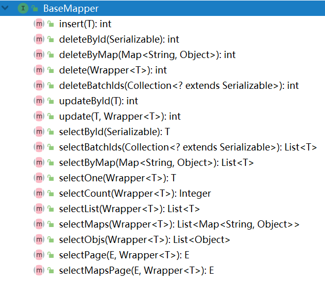

# 关于数据库连接池

数据库连接池的具体表现是`javax.sql.DataSource`类型的对象，它用于管理若干个数据库连接（`Connection`对象），当需要连接到数据库时，从`DataSource`中取出`Connection`对象即可！

`DataSource`是一个接口，有许多第三方的实现，例如：

- `commons-dbcp2`（是早期的`commons-dbcp`的升级款）
- `Hikari`
- `Druid`
- 其它

在绝大部分情况下，Spring Boot项目默认使用的是`Hikari`。

如果要替换为其它数据库连接池，首先，需要添加对应的依赖，然后，在配置文件中显式的指定对应的`DataSource`。

以替换为`Durid`为例，首先，需要添加`druid-spring-boot-starter`依赖项！先在`csmall-server`中添加：


并在`csmall-product`中添加依赖项：


然后，在`application.properties` / `application.yml`中添加配置，以`.properties`文件的配置为例：

```properties
spring.datasource.type=数据库连接池的类的全限定名
```

通常，还会配置：

```properties
spring.datasource.type.druid.initial-size=初始化连接数
spring.datasource.type.druid.max-active=最大激活数
```

以`.yml`文件配置为例：


# 数据库中的数据类型与Java数据类型的对应

| 数据库中的类型                  | Java中的类型    |
| ------------------------------- | --------------- |
| `tinyint` / `smallint` / `int`  | `Integer`       |
| `bigint`                        | `Long`          |
| `char` / `varchar` / `text`系列 | `String`        |
| `datetime`                      | `LocalDateTime` |
| `decimal`                       | `BigDecimal`    |

# POJO的设计规范

所有用于声明属性的类，都应该遵循以下规范：

- 存在无参数构造方法
- 所有属性都是私有权限（`private`）的
- 添加每个属性对应的Setters & Getters
- 添加基于所有属性的`hashCode()`与`equals()`
  - 必须保证：如果2个对象的所有属性值完全相同，则`equals()`对比结果为`true`，否则，返回`false`，如果2个对象的`equals()`为`true`，则这2个对应的`hashCode()`返回相同的值，否则，返回不同的值
  - 通常，所有专门的开发软件生成的这2个方法都符合以上特征
- 实现`Serializable`接口

另外，为了便于观察各属性的值，建议添加`toString()`方法。

# 关于Lombok框架

此框架的依赖项代码：

```xml
<lombok.version>1.18.20</lombok.version>
```

```xml
<!-- Lombok的依赖项，主要用于简化POJO类的编写 -->
<dependency>
    <groupId>org.projectlombok</groupId>
    <artifactId>lombok</artifactId>
    <version>${lombok.version}</version>
</dependency>
```

Lombok的主要作用是：通过特定的注解，在**编译期**生成对应的代码。

例如，在类上添加`@Data`注解，则会生成此类中所有属性对应的Setters & Getters、`hashCode()`、`equals()`、`toString()`方法：

```java
@Data
public class Album implements Serializable {

    private Long id;
    private String name;
    private String description;
    private Integer sort;
    private LocalDateTime gmtCreate;
    private LocalDateTime gmtModified;

}
```

**注意：**使用`@Data`注解时，需要保证当前类的父类存在无参数构造方法。

**注意：**你需要在开发工具中安装Lombok插件：


如果没有安装插件，在编写代码时，开发工具无法给出快捷提示，并且，直接写出相关的代码也会报红，但是，并不影响运行！

由于使用Lombok框架，需要在开发工具中安装对应的插件，所以，并不是所有人都喜欢使用这个框架，甚至有些开发团队会禁止使用这个框架。

关于Lombok的常用注解，可参考安装插件的界面：


# MyBatis Plus

MyBatis Plus是一款基于MyBatis的框架，它内置已经实现了许多数据访问方法，在开发时，可以不必再编写常规的数据访问方法，能够简化一部分开发。

MyBatis Plus整合Spring Boot的依赖项为：

```xml
<mybatis-plus-spring-boot.version>3.3.0</mybatis-plus-spring-boot.version>
```

```xml
<!-- Mybatis Plus整合Spring Boot的依赖项 -->
<dependency>
    <groupId>com.baomidou</groupId>
    <artifactId>mybatis-plus-boot-starter</artifactId>
    <version>${mybatis-plus-spring-boot.version}</version>
</dependency>
```

以“新增相册”为例，首先，你需要自定义实体类，并且：

- 在类上使用`@TableName`注解指定数据表的名称
  - 例如配置为`@TableName("pms_album")`
  - 如果没有通过以上注解指定名称，则MyBatis Plus会自动根据你的实现类的名称转换得到表名称，例如`Album`类对应的默认的表名称就是`album`
- 在类中与主键对应的属性上使用`@TableId`注解指定主键的值如何处理
  - 例如配置为`@TableId(type = IdType.AUTO)`
  - 如果没有通过以上注解进行配置，则MyBatis Plus默认会自动处理主键字段对应的值

例如：


然后，与使用普通的MyBatis相同，需要自定义数据访问接口，不同的是，此接口应该继承自`BaseMapper`，且继承的泛型应该是尝试处理的数据表所对应的实体类的类型，例如：


另外，原本应该做的配置不变，例如在配置类中使用`@MapperScan`指定Mapper接口所在的包。

至此，就已经可以使用MyBatis Plus提供的各种数据访问功能，包括：



# 关于Service

Service的核心价值在于：组织业务流程，处理业务逻辑，以保证数据的完整性、有效性、安全性。

在编写代码时，强烈建议先定义Service的接口，然后，自定义编写其实现类。

关于“新增相册”，先自定义POJO类，用于封装相关参数！在项目的根包下创建`pojo.param.AlbumAddNewParam`类：

```java
@Data
public class AlbumAddNewParam implements Serializable {
    private String name;
    private String description;
    private Integer sort;
}
```

然后，在项目的根包下创建`service.IAlbumService`，并在接口中添加“新增相册”的抽象方法：

```java
public interface IAlbumService {
    void addNew(AlbumAddNewParam albumAddNewParam);
}
```

然后，在项目的根包下创建`service.impl.AlbumServiceImpl`类，实现以上接口：

```java
public class AlbumServiceImpl implements IAlbumService {}
```

关于Service方法的声明：

- 返回值类型：仅以操作成功为前提来设计返回值
  - 操作失败全部通过抛出异常来表示
- 方法名称：自定义
- 参数列表：如果参数数量较多，且具有相关性，可以封装，如果参数数量较少，或不具备相关性，则逐一声明
- 抛出异常：抛出所有遇到的异常，如果只会出现`RuntimeException`，并不需要使用`throws`关键字显式的声明

在具体实现之前，为了明确的表示出错的原因是因为所设计的规则，应该先自定义异常类型，并且，在规则验证不通过时，抛出自定义异常类型，后续，在调用此方法时，根据是否抛出了自定义异常类型来判断是否符合所设计的规则。

在项目的根包下创建`ex.ServiceException`类，继承自`RuntimeException`类，并添加基于父级异常的、带`String message`参数的构造方法：

```java
public class ServiceException extends RuntimeException {

    public ServiceException(String message) {
        super(message);
    }
    
}
```

关于自定义异常需要继承自`RuntimeException`，原因主要有2点：

- 如果继承的不是`RuntimeException`，抛出异常的方法必须显式的使用`throws`声明抛出，并且，Service方法的调用者（Controller）也必须在代码中明确的`try...catch`或`throws`，而开发实践中，会使用Spring MVC框架的全局异常处理机制来统一处理异常，则Service、Controller等组件都必须将异常抛出，这是固定的做法，所以，没有必要继承自非`RuntimeException`并反复声明抛出异常
- 基于Spring JDBC的事务管理将根据`RuntimeException`进行回滚

然后，在`AlbumServiceImpl`类上添加`@Service`注解，在类中自动装配`AlbumMapper`类型的属性，并实现接口中定义的抽象方法，在实现过程中，如果判断违背了所设计的规则，应该抛出自定义的`ServiceException`类型的异常对象：

```java
@Service
public class AlbumServiceImpl implements IAlbumService {

    @Autowired
    private AlbumMapper albumMapper;

    @Override
    public void addNew(AlbumAddNewParam albumAddNewParam) {
        // 检查相册名称是否被占用，如果被占用，则抛出异常
        QueryWrapper<Album> queryWrapper = new QueryWrapper<>();
        queryWrapper.eq("name", albumAddNewParam.getName()); // name='参数中的相册名称'
        int countByName = albumMapper.selectCount(queryWrapper);
        if (countByName > 0) {
            String message = "添加相册失败，相册名称已经被占用！";
            // System.out.println(message);
            throw new ServiceException(message);
        }

        // 将相册数据写入到数据库中
        Album album = new Album();
        BeanUtils.copyProperties(albumAddNewParam, album);
        album.setGmtCreate(LocalDateTime.now());
        album.setGmtModified(LocalDateTime.now());
        albumMapper.insert(album);
    }

}
```

完成后，应该在`src/test/java`下的根包下创建`service.AlbumServiceTests`测试类，测试以上方法：

```java
@SpringBootTest
public class AlbumServiceTests {

    @Autowired
    IAlbumService service;

    @Test
    void addNew() {
        AlbumAddNewParam albumAddNewParam = new AlbumAddNewParam();
        albumAddNewParam.setName("测试数据-00003");
        albumAddNewParam.setDescription("测试数据简介-00003");
        albumAddNewParam.setSort(99);

        try {
            service.addNew(albumAddNewParam);
            System.out.println("添加成功！");
        } catch (ServiceException e) {
            System.out.println(e.getMessage());
        } catch (Throwable e) {
            System.out.println("添加失败！出现了某种异常！");
            e.printStackTrace();
        }
    }

}
```

# 通过控制器接收并处理请求

在通过控制器处理请求之前，需要添加对应的依赖项：`spring-boot-starter-web`。

提示：所有Spring提供的以`spring-boot-starter`作为名称前缀的依赖项（例如`spring-boot-starter-web`），都包含了Spring Boot的基础依赖项（`spring-boot-starter`）。

则将项目中原本依赖的`spring-boot-starter`改为`spring-boot-starter-web`。

在项目的根包下创建`controller.AlbumController`，在类中添加方法处理“添加相册”的请求：

```java
@RestController
@RequestMapping("/album")
public class AlbumController {

    @Autowired
    private IAlbumService albumService;

    // http://localhost:8080/album/add-new?name=TestName001&description=TestDescription001&sort=99
    @RequestMapping("/add-new")
    public String addNew(AlbumAddNewParam albumAddNewParam) {
        try {
            albumService.addNew(albumAddNewParam);
            return "添加成功！";
        } catch (ServiceException e) {
            return e.getMessage();
        } catch (Throwable e) {
           return "添加失败！出现了某种异常！";
        }
    }

}
```

完成后，启动项目，在浏览器的地址栏中使用 http://localhost:8080/album/add-new?name=TestName001&description=TestDescription001&sort=99 即可测试访问。

# 关于各组件的处理流程


```
User login(String username, String password, String verifyCode) throws 用户名错误异常, 密码错误异常, 账号禁用异常, 验证码错误异常;

try {
	User user = service.login("root", "1234", "9xk2");
	// 登录成功
} catch (用户名错误异常 e) {
	// 
} catch (密码错误异常 e) {
	// 
} catch (账号禁用异常 e) {
	// 
} catch (验证码错误异常 e) {
	// 
}
```

```
xx reg(User user);

User user = new User();
user.setUsername("root");
user.setPassword("1234");
user.setVerifyCode("xx3f");
service.login(user);

public class User{
    // username
    // password
    // verifyCode
}
```


