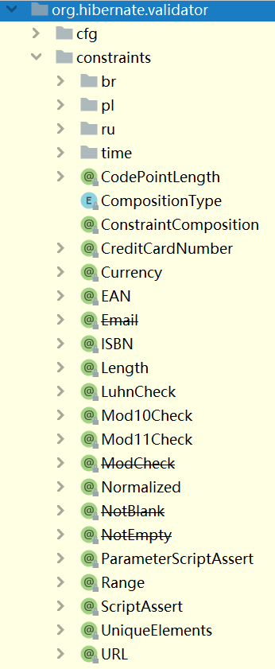
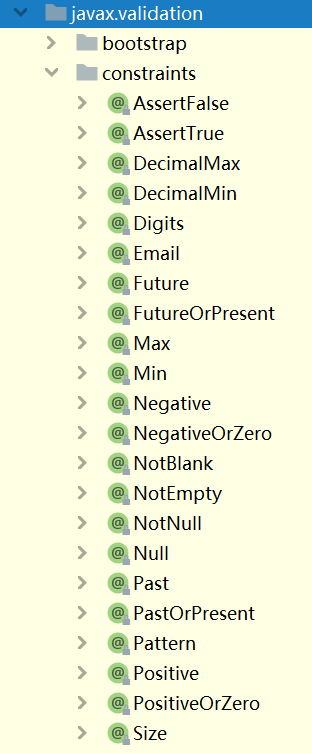

# Spring MVC框架的统一处理异常机制

Spring MVC提供了统一处理异常的机制，使得在同一个项目中，每种类型的异常，只需要有1段处理此异常的代码即可！

在统一处理异常时，需要自定义处理异常的方法，关于此方法：

- 注解：必须添加`@ExceptionHandler`注解
- 访问权限：应该是`public`权限
- 返回值类型：参考处理请求的方法
- 方法名称：自定义，参考处理请求的方法
- 参数列表：必须包含1个异常类型的参数，表示此方法需要处理的异常，并且，不可以像处理请求的方法那样随意添加参数，但也可以按需添加特定的几种类型的参数，例如`HttpServletRequest`、`HttpServletResponse`等

例如：

```java
@ExceptionHandler
public String handleServiceException(ServiceException e) {
    log.warn("程序运行过程中出现了ServiceException，将统一处理！");
    log.warn("异常信息：{}", e.getMessage());
    return e.getMessage();
}
```

如果将以上方法定义在某个Controller中，它将只能作用于那个Controller中处理请求的方法抛出的异常，不能处理别的Controller中的异常！可以将以上方法定义在专门的类中，并在类上添加`@RestControllerAdvice`注解，添加此注解后，此类中所有特定的方法（例如添加`@ExceptionHandler`的方法）可以作用于当前项目中每次处理请求的过程中！

例如，创建`GlobalExceptionHandler`类，在类上添加`@RestControllerAdvice`注解，并将以上处理异常的方法添加在此类中：

```java
@Slf4j
@RestControllerAdvice
public class GlobalExceptionHandler {

    @ExceptionHandler
    public String handleServiceException(ServiceException e) {
        log.warn("程序运行过程中出现了ServiceException，将统一处理！");
        log.warn("异常信息：{}", e.getMessage());
        return e.getMessage();
    }

}
```

在以上类中，可以存在多个处理异常的方法，用于处理不同种类的异常！

允许同时存在处理了父子级异常的方法，例如某个方法处理`NullPointerException`，另一个方法处理`RuntimeException`，后续，当出现`NullPointerException`时，虽然匹配此异常的处理方法有2个，但是，会执行类型最接近此异常的方法，也就是由处理`NullPointerException`异常的方法进行处理，而不会由处理`RuntimeException`异常的方法进行处理！

建议在每个项目的全局异常处理器中，都添加处理`Throwable`异常的方法，避免此项目向客户端反馈`500`错误，例如：

```java
// 【注意】在项目正式上线时，禁止使用 e.printStackTrace();
@ExceptionHandler
public String handleThrowable(Throwable e) {
    log.warn("程序运行过程中出现了Throwable，将统一处理！");
    log.warn("异常：", e); // 取代 e.printStackTrace();，效果相同，注意，第1个参数中不要使用 {} 进行占位
    String message = "服务器忙，请稍后再试！【在开发过程中，如果看到此提示，应该检查服务器端的控制台，分析异常，并在全局异常处理器中补充处理对应异常的方法】";
    return message;
}
```

# Spring Validation框架

## 关于Spring Validation

Spring Validation框架的主要作用是检查方法的参数的基本有效性。

## 添加依赖

此框架的依赖项的`artifactId`为：`spring-boot-starter-validation`。

```xml
<!-- Spring Boot支持Spring Validation用于检查方法参数的基本有效性的依赖项 -->
<dependency>
    <groupId>org.springframework.boot</groupId>
    <artifactId>spring-boot-starter-validation</artifactId>
    <version>${spring-boot.version}</version>
</dependency>
```

## 检查封装的请求参数

需要先在方法的参数（封装的类型）前添加`@Valid`或`@Validated`注解，以表示“将检查此参数的基本有效性”，例如：

```java
@PostMapping("/add-new")
public String addNew(@Valid AlbumAddNewParam albumAddNewParam) {
    albumService.addNew(albumAddNewParam);
    return "添加成功！";
}
```

然后，需要在封装的类型的属性上添加检查注解，以配置对应的检查规则，例如：

```java
@Data
public class AlbumAddNewParam implements Serializable {

    @NotNull
    private String name;
    
}
```

经过以上配置，参数`name`将不允许为`null`值，如果客户端提交的请求中没有`name`的值，将直接响应`400`错误！

## 处理BindException

当检查参数的基本有效性不通过时，在服务器端的控制台会提示错误详情，例如：

```
2023-05-11 14:25:21.058  WARN 45924 --- [nio-8080-exec-1] .w.s.m.s.DefaultHandlerExceptionResolver : Resolved [org.springframework.validation.BindException: org.springframework.validation.BeanPropertyBindingResult: 1 errors

Field error in object 'albumAddNewParam' on field 'name': rejected value [null]; codes [NotNull.albumAddNewParam.name,NotNull.name,NotNull.java.lang.String,NotNull]; arguments [org.springframework.context.support.DefaultMessageSourceResolvable: codes [albumAddNewParam.name,name]; arguments []; default message [name]]; default message [不能为null]]
```

检查注解还可以配置`message`属性，用于指定检查不通过时的文本信息，例如：

```java
@NotNull(message = "添加相册失败，必须提交相册名称！")
private String name;
```

经过以上配置后，如果检查失败，错误信息大致如下：

```
Field error in object 'albumAddNewParam' on field 'name': rejected value [null]; codes [NotNull.albumAddNewParam.name,NotNull.name,NotNull.java.lang.String,NotNull]; arguments [org.springframework.context.support.DefaultMessageSourceResolvable: codes [albumAddNewParam.name,name]; arguments []; default message [name]]; default message [添加相册失败，必须提交相册名称！]
```

然后，需要在全局异常处理器中添加处理`BindException`请求的方法：

```java
@ExceptionHandler
public String handleBindException(BindException e) {
    log.warn("程序运行过程中出现了BindException，将统一处理！");
    log.warn("异常信息：{}", e.getMessage());
    // 【解决方案-1】使用1个字符串表示1个错误信息
    String message = e.getFieldError().getDefaultMessage();
    return message;

    // 【解决方案-2】使用1个字符串表示错误信息
    // StringJoiner stringJoiner = new StringJoiner("，", "请求参数错误，", "！");
    // List<FieldError> fieldErrors = e.getFieldErrors();
    // for (FieldError fieldError : fieldErrors) {
    //    String defaultMessage = fieldError.getDefaultMessage();
    //    stringJoiner.add(defaultMessage);
    // }
    // return stringJoiner.toString();

    // 【解决方案-3】使用集合表示多个错误信息，需要将当前方法的返回值类型声明为对应的集合类型
    // List<String> messageList = new ArrayList<>();
    // List<FieldError> fieldErrors = e.getFieldErrors();
    // for (FieldError fieldError : fieldErrors) {
    //    String defaultMessage = fieldError.getDefaultMessage();
    //    messageList.add(defaultMessage);
    // }
    // return messageList;
}
```

需要注意：Spring Validation在检查请求参数的格式时，会检查所有属性配置的规则，找出所有的错误，如果希望实现“只要发现错误，就不再向后检查”，需要将其配置为“快速失败”，配置做法是使用配置类：

```java
@Slf4j
@Configuration
public class ValidationConfiguration {

    public ValidationConfiguration() {
        log.debug("创建配置类对象：ValidationConfiguration");
    }

    @Bean
    public javax.validation.Validator validator() {
        return Validation.byProvider(HibernateValidator.class)
                .configure() // 开始配置
                .failFast(true) // 配置快速失败
                .buildValidatorFactory() // 构建Validator工厂
                .getValidator(); // 从Validator工厂中获取Validator对象
    }

}
```

## 检查未封装的请求参数

对于未封装的请求参数（例如参数列表中的`Long id`）的检查，需要先在当前方法所在的类上添加`@Validated`注解，例如：

```java
@RestController
@RequestMapping("/album")
@Validated
public class AlbumController {
}
```

然后，在参数上添加对应的检查注解，例如：

```java
@PostMapping("/delete")
public String delete(@Range(min = 1, message = "根据ID删除相册失败，请提交合法的ID值！") 
                     @RequestParam Long albumId) throws Exception {
    // ...
}
```

暂时不使用全局异常处理器，当提交的请求参数不符合以上配置的规则时，在服务器的控制台可以看到错误信息：

```
javax.validation.ConstraintViolationException: delete.albumId: 根据ID删除相册失败，请提交合法的ID值！
```

则需要在全局异常处理器中添加处理以上异常：

```java
@ExceptionHandler
public String handleConstraintViolationException(ConstraintViolationException e) {
    log.warn("程序运行过程中出现了ConstraintViolationException，将统一处理！");
    log.warn("异常信息：{}", e.getMessage());
    String message = null;
    Set<ConstraintViolation<?>> constraintViolations = e.getConstraintViolations();
    for (ConstraintViolation<?> constraintViolation : constraintViolations) {
        message = constraintViolation.getMessage();
    }
    return message;
}
```

## 检查注解

在`org.hibernate.validator.constraints`和`javax.validation.constraints`这2个包中的都是检查注解！





常用的检查注解有：

- `@NotNull`：不允许为`null`值
  - 可以用于任何类型
- `@NotEmpty`：不允许为空字符串（长度为0的字符串），并且会检查是否为`null`值（为`null`时报错）
  - 仅能用于字符串类型的参数
- `@NotBlank`：不允许为空白，即不允许是“仅由空格、TAB等空白值组成的字符串”
  - 仅能用于字符串类型的参数
- `@Range`：通过配置`min`和`max`属性来限制数值类型参数的值区间，它不会检查是否为`null`（为`null`并不执行任何检查，且不会报错）
  - 仅能用于整型参数
- `@Pattern`：通过配置`regexp`属性来配置正则表达式
  - 仅能用于字符串类型的参数

# 响应结果的类型

当成功的添加相册时，服务器将响应：

```
添加成功！
```

如果相册的名称已经被占用，服务器将响应：

```
添加相册失败，相册名称已经被占用！
```

如果提交的请求参数不符合服务器端的检查规则，例如没有提交相册名称时，服务器将响应：

```
添加相册失败，必须提交相册名称！
```

以上响应的结果其实是无法正常使用的！当客户端向服务器发请求后，如果得到的是以上结果，则需要：

```javascript
axios.post("/album/add-new", v.album).then(function (response) {
  if (response.data == '添加成功！'){
    // ...
  } else if (response.data == '添加相册失败，相册名称已经被占用！'){
    // ...
  } else if (response.data == '添加相册失败，必须提交相册名称！') {
    // ...
  } else if (... 其它错误) {
    // ...
  }
})
```

以上代码中，使用字符串来判断操作结果是错误的做法！因为字符串是可能调整的，并且，不适用于国际化！

通常，应该使用特定的代码（或代号）来表示不同的状态！例如，使用`1`表示成功，使用`2`表示某种失败，使用`3`表示另一种失败等等！

另外，服务器端仍应该提供出错时的描述文本，而客户端只需要获取到这些文本并直接显示在软件的界面中即可（客户端不会自行组织语言来设计错误时的描述文本）。

所以，服务器端需要向客户端响应操作结果对应的代码（或代码），同时还要响应出错时的描述文本！

则可以创建`JsonResult`类，在类中声明需要响应的数据属性，例如：

```java
@Data
public class JsonResult implements Serializable {
    private Integer state;
    private String message;
}
```

然后，处理请求的方法、处理异常的方法，都应该使用以上类型作为方法的返回值类型，例如：

```java
@PostMapping("/add-new")
public JsonResult addNew(@Valid AlbumAddNewParam albumAddNewParam) {
    log.debug("开始处理【添加相册】的请求，参数：{}", albumAddNewParam);
    albumService.addNew(albumAddNewParam);

    JsonResult jsonResult = new JsonResult();
    jsonResult.setState(1);
    jsonResult.setMessage("添加成功！");
    return jsonResult;
}
```

```java
@ExceptionHandler
public JsonResult handleServiceException(ServiceException e) {
    log.warn("程序运行过程中出现了ServiceException，将统一处理！");
    log.warn("异常信息：{}", e.getMessage());

    JsonResult jsonResult = new JsonResult();
    jsonResult.setState(2);
    jsonResult.setMessage(e.getMessage());
    return jsonResult;
}
```

经过以上调整以后，在执行过程中，服务器端的Spring MVC会将返回的对象转换为JSON格式再进行响应，例如：

```json
{
  "state": 1,
  "message": "添加成功！"
}
```

```json
{
  "state": 2,
  "message": "添加相册失败，相册名称已经被占用！"
}
```

```json
{
  "state": 3,
  "message": "添加相册失败，必须提交相册名称！"
}
```

后续，客户端的代码就可以调整为：

```javascript
axios.post("/album/add-new", v.album).then(function (response) {
  if (response.data.state == 1){
    // 成功
  } else if (response.data.state == 2){
    // 显示response.data.message
  } else if (response.data.state == 3) {
    // 显示response.data.message
  }
})
```


