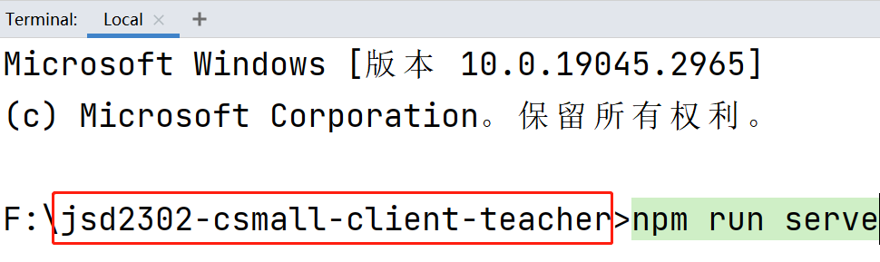
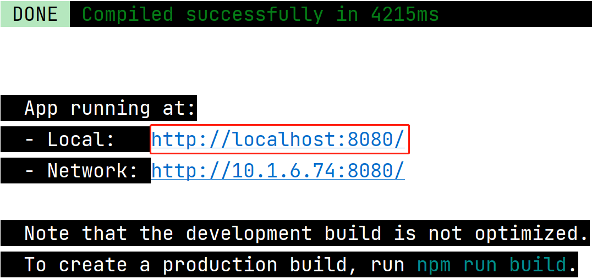
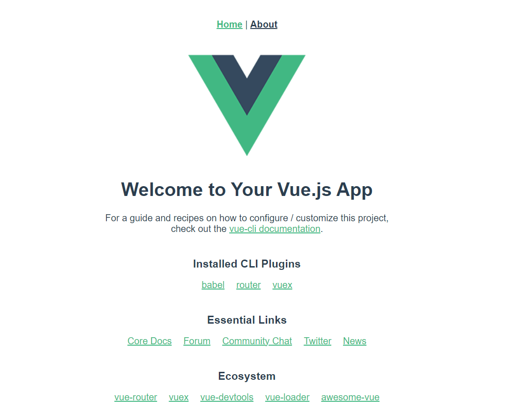
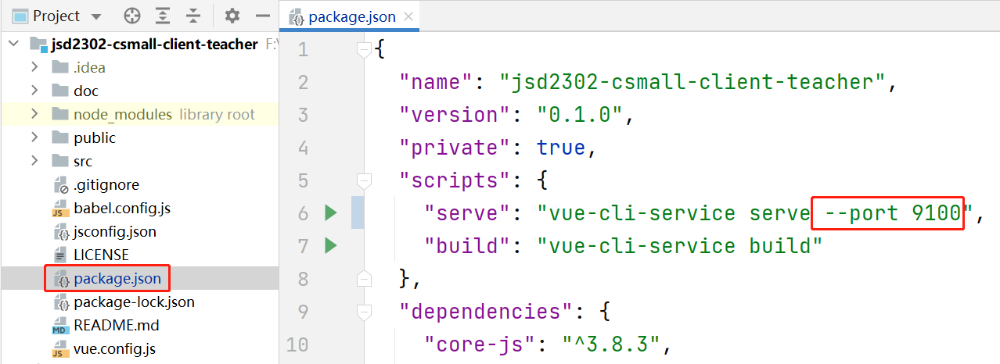
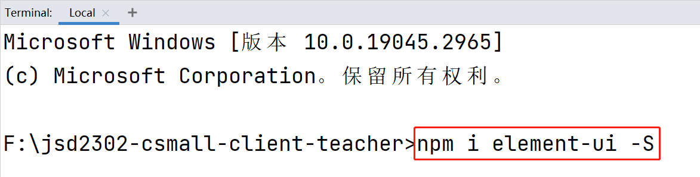
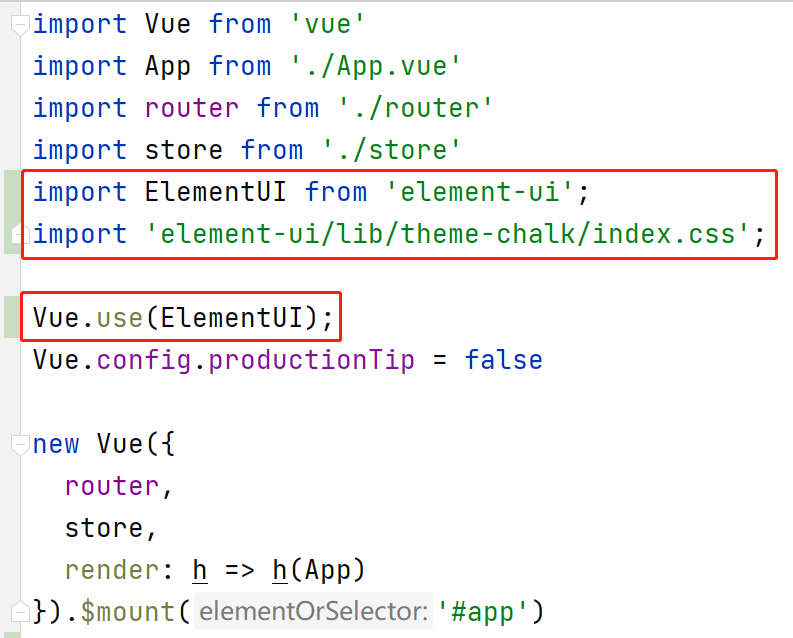

# 前端教学项目地址

```
https://gitee.com/chengheng2022/jsd2302-csmall-client-teacher.git
```

# 启动VUE Cli项目

打开终端窗口，在**当前项目的文件夹（必须）**下执行`npm run serve`命令即可启动项目：



当启动成功后：



**提示：**根据各台电脑的网络配置不同，启动成功时，提示的网址可能不同，这并不影响学习和运行项目，只要当前电脑有网络，必然有 http://localhost:8080/ 这个URL的提示！

启动成功后，可以根据提示的 URL 在浏览器中进行访问，然后，可以看到默认的页面：



此项目会默认占用`8080`端口，如果启动之前此端口就已经被其它应用程序占用，则会自动顺延，改为使用`8081`端口，如果仍被占用，则再次顺延！

如果需要指定端口号，需要修改`package.json`文件中的`scripts`属性下的`serve`属性：



# VUE Cli项目结构

VUE Cli项目也称之为“VUE脚手架”项目，此类项目有相对固定的项目结构，是一种“单页面”的项目，在这个项目中，有且仅有1个HTML文件，此文件的内容是可以由多个“视图组件”所组成的，并且，可以按需替换各视图组件，使得整个显示效果更加灵活，各视图组件也可以实现“复用”的效果。

- `[.idea]`：是IntelliJ IDEA管理项目时自动处理的文件夹，不需要手动管理，如果此文件夹报错，删除即可
  - 只要是使用IntelliJ IDEA打开过的项目，都有这个文件夹，并不是VUE Cli项目特有的
- **【重要】**`[node_modules]`：存放当前项目所需的依赖项的文件夹，不需要手动管理，通常，此文件夹会被配置到`.gitignore`文件夹，所以，如果从GIT仓库拉取项目，通常没有此文件夹，则项目是无法启动的，需要在当前项目文件夹下执行`npm install`命令，执行此命令会自动下载当前项目所需要的依赖项
- **【重要】**`[public]`：静态资源文件夹，通常存放`.html`、`.css`、`.js`、图片等文件，此文件夹的作用类似Spring Boot项目中的`src/resources/static`，如果存放在此文件夹中的内容显示有误，可以尝试重启项目并清除浏览器的缓存
  - `favicon.ico`：项目的图标文件，是固定的存放位置和固定的文件名
  - `index.html`：当前项目唯一的HTML文件，通常不会在此文件中设计页面的显示，此文件中的设计将作用于当前项目允许访问的每个页面
- `[src]`：源代码文件夹
  - `[assets]`：静态资源文件夹，存放在此文件夹下的内容，不可以随着程序的运行而发生变化
  - `[compnents]`：用于存放视图组件的文件，通常，此文件夹下的视图组件是会被其它视图组件所调用的
  - **【重要】**`[router]`：用于存放配置路由信息的文件夹
    - `index.js`：默认的配置路由信息的文件
  - `[store]`：用于存入配置全局属性的文件夹
  - **【重要】**`[views]`：用于存放视图组件的文件夹
  - **【重要】**`App.vue`：默认被加载并注入到`index.html`中的视图组件
  - **【重要】**`main.js`：项目的主配置文件
- `.gitignore`：配置GIT应该忽略哪些文件或文件夹，即：当向GIT仓库提交代码时，所配置的文件或文件夹不会被提交
- **【重要】**`package.json`：项目的配置文件，主要配置了：当前项目的依赖项、相关脚本（运行、编译）

# 关于视图组件

在VUE Cli项目中，视图组件表现为以`.vue`为扩展名的文件。

每个视图组件都可以由3部分组成：

- `<template>`：用于设计页面内容
  - **注意：**在根级`<template>`标签下，只能有1个直接子标签
- `<style>`：用于编写CSS样式
- `<script>`：用于编写JavaScript程序

# 关于`<router-view/>`标签

在视图组件中设计页面内容时，可以使用`<router-view/>`表示：此处将由其它视图组件来完成显示。

在`<router-view/>`中显示的视图组件，是根据当前访问的URL，结合`src/router`的配置来决定的！

# 使用Element UI

首先，需要在当前项目文件夹下，通过命令安装Element UI：

```
npm i element-ui -S
```

例如：



安装完成后，还需要在`main.js`中添加配置：

```javascript
import ElementUI from 'element-ui';
import 'element-ui/lib/theme-chalk/index.css';

Vue.use(ElementUI);
```

例如：



完成后，在当前项目中的任何视图组件中，都可以直接使用Element UI。

提醒：如果你此前已经从GITEE下载了老师的项目，再次更新后，你需要执行1次`npm install`下载新增的依赖项，才可以运行老师的项目。


