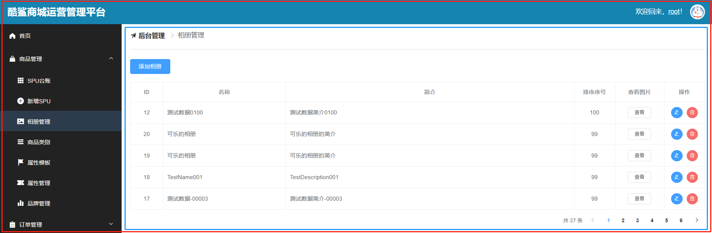
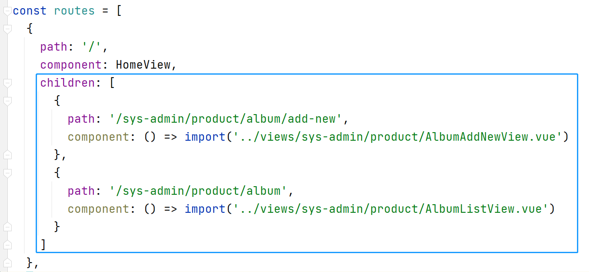
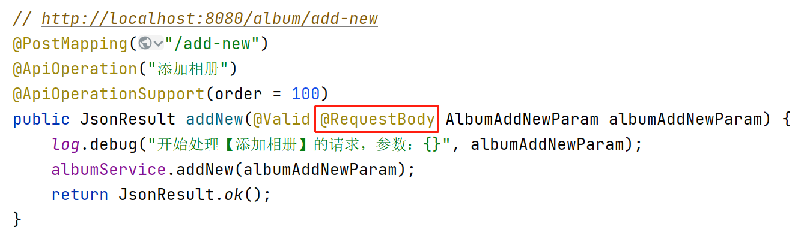
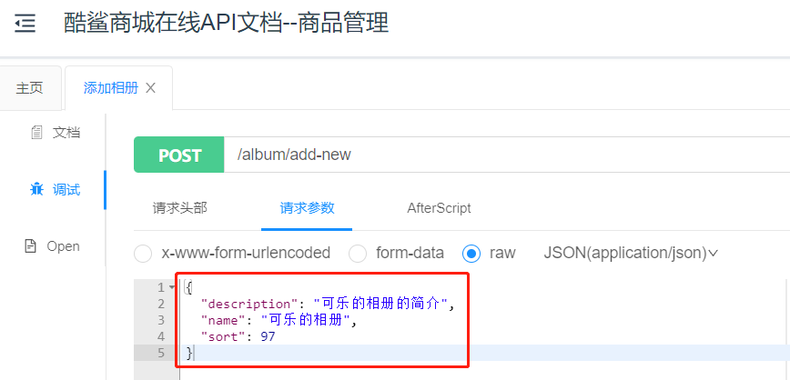
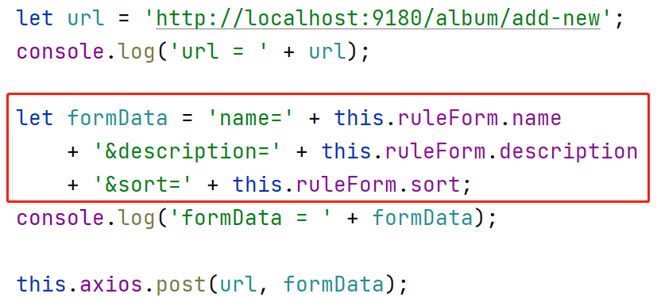

# 嵌套路由

在VUE Cli项目中，`index.html`固定加载`App.vue`，在`App.vue`中配置的`<router-view>`将负责整个页面的显示（`App.vue`中只有`<router-view/>`的情况下），如下图红色框住的区域，在`HomeView.vue`中再次使用了`<router-view/>`，如下图蓝色框住的区域，则称之为“嵌套”！



在视图的设计出现嵌套，则路由的配置也需要嵌套！例如：



可以理解为：在`routes`常量下配置的路由，是将对应的视图显示在`App.vue`的`<router-view/>`中，如果需要配置嵌套路径，需要在设计了`<router-view/>`的视图的路由（例如以上`HomeView`的路由配置）中添加`children`属性，此属性的数据类型、配置方式与`routes`是相同的，配置在子级的路由（例如以上`AlbumAddNewView.vue`和`AlbumListView.vue`）的视图就会显示在`HomeView`的`<router-view/>`中。

# 使用Axios发送请求并处理结果

首先，需要安装axios，安装命令为：

```
npm i axios -S
```

然后，需要在`main.js`中添加配置：

```javascript
import axios from 'axios';

Vue.prototype.axios = axios;
```

使用axios向服务器端发送请求后，可能出现以下错误：

```
Access to XMLHttpRequest at 'http://localhost:9180/album/add-new' from origin 'http://localhost:9100' has been blocked by CORS policy: Response to preflight request doesn't pass access control check: No 'Access-Control-Allow-Origin' header is present on the requested resource.
```

以上错误源自“跨域”访问的问题！即`9100`端口的服务默认不允许通过异步的方式访问其它端口（例如`9180`端口）的后端服务。

如果需要允许跨域访问，需要在服务器端添加Spring MVC框架的配置类，此类需要实现`WebMvcConfigurer`接口，重写其中的`addCorsMappings()`方法，以配置跨域：

```java
package cn.tedu.csmall.product.config;

import lombok.extern.slf4j.Slf4j;
import org.springframework.context.annotation.Configuration;
import org.springframework.web.servlet.config.annotation.CorsRegistry;
import org.springframework.web.servlet.config.annotation.WebMvcConfigurer;

/**
 * Spring MVC配置类
 *
 * @author java@tedu.cn
 * @version 0.0.1
 */
@Slf4j
@Configuration
public class WebMvcConfiguration implements WebMvcConfigurer {

    public WebMvcConfiguration() {
        log.debug("创建配置类对象：WebMvcConfiguration");
    }

    @Override
    public void addCorsMappings(CorsRegistry registry) {
        registry.addMapping("/**")
                .allowedHeaders("*")
                .allowedMethods("*")
                .allowedOriginPatterns("*")
                .allowCredentials(true)
                .maxAge(3600);
    }

}
```

# 关于`@RequestBody`注解

## 使用`@RequestBody`注解

当客户端提交的请求参数是对象时，在服务器端接收请求参数时需要使用`@RequestBody`注解，例如：



如果没有添加`@RequestBody`，服务器端收到的所有请求参数都是`null`。

当添加了`@RequestBody`后，服务器端要求提交的请求参数必须是对象，所以，在API文档中的调试页面，不再有输入各数据的输入框，而是一个JSON对象参数：



如果客户端提交的请求参数是FromData格式的，服务器端接收到请求时会报错：

```
Resolved [org.springframework.web.HttpMediaTypeNotSupportedException: Content type 'application/x-www-form-urlencoded;charset=UTF-8' not supported]
```

## 不使用`@RequestBody`注解

当服务器端的请求参数上没有使用`@RequestBody`时，客户端提交的请求参数必须是FormData格式的，例如：

```
name=测试数据001&description=测试数据简介001&sort=91
```

所以，在发出请求之前，应该将对象格式的参数重新组织为FormData格式的，例如：



关于对象格式的数据转换为FormData格式，可以使用`qs`框架来解决，首先，安装此依赖项：

```
npm i qs -S
```

然后，需要在`main.js`中添加配置：

```javascript
import qs from 'qs';

Vue.prototype.qs = qs;
```

然后，就可以通过qs将对象格式的数据转换为FormData类型，例如：

```javascript
let formData = this.qs.stringify(this.ruleForm);
```

# PageHelper框架

PageHelper框架是专门用于MyBatis / MyBatis-Plus的分页框架！

```xml
<pagehelper-spring-boot.version>1.3.0</pagehelper-spring-boot.version>
```

```xml
<!-- 基于MyBatis或MyBatis Plus的分页查询框架 -->
<dependency>
    <groupId>com.github.pagehelper</groupId>
    <artifactId>pagehelper-spring-boot-starter</artifactId>
    <version>${pagehelper-spring-boot.version}</version>
</dependency>
```

可以通过测试类，测试使用PageHelper，例如：

```java
package cn.tedu.csmall.product;

import cn.tedu.csmall.product.mapper.AlbumMapper;
import cn.tedu.csmall.product.pojo.vo.AlbumListItemVO;
import com.github.pagehelper.PageHelper;
import com.github.pagehelper.PageInfo;
import org.junit.jupiter.api.Test;
import org.springframework.beans.factory.annotation.Autowired;
import org.springframework.boot.test.context.SpringBootTest;

import java.util.List;

@SpringBootTest
public class PageHelperTests {

    @Autowired
    AlbumMapper mapper;

    @Test
    void list() {
        // 页码，从1开始计数
        int pageNum = 1;
        // 每页记录数，即：每页查询几条数据
        int pageSize = 5;
        // 执行分页查询，传入页码、每页记录数参数
        // 注意：以下语句和Mapper执行查询必须时连续的2条语句，不要添加别的有效语句，特别是if等分支，否则可能导致线程安全问题
        PageHelper.startPage(pageNum, pageSize);
        List<AlbumListItemVO> list = mapper.list();
        // 基于查询结果创建PageInfo对象，此对象中包括大量分页查询时所需的参数
        PageInfo<AlbumListItemVO> pageInfo = new PageInfo<>(list);
        System.out.println(pageInfo);
    }
}
```

输出结果例如：

```
PageInfo{
	pageNum=1, 
	pageSize=5, 
	size=5, 
	startRow=1, 
	endRow=5, 
	total=43, 
	pages=9, 
	list=Page{
		count=true, 
		pageNum=1, 
		pageSize=5, 
		startRow=0, 
		endRow=5, 
		total=43, 
		pages=9, 
		reasonable=false, 
		pageSizeZero=false
	}[
		AlbumListItemVO(id=12, name=测试数据0100, description=测试数据简介0100, sort=100), 
		AlbumListItemVO(id=35, name=测试相册005, description=测试相册的简介005, sort=99), 
		AlbumListItemVO(id=30, name=测试相册002, description=测试相册的简介002, sort=99),
        AlbumListItemVO(id=29, name=测试相册001, description=测试相册的简介001, sort=99),
        AlbumListItemVO(id=20, name=可乐的相册, description=可乐的相册的简介, sort=99)
      ], 
      prePage=0, 
      nextPage=2, 
      isFirstPage=true, 
      isLastPage=false, 
      hasPreviousPage=false, 
      hasNextPage=true, 
      navigatePages=8, 
      navigateFirstPage=1, 
      navigateLastPage=8, 
      navigatepageNums=[1, 2, 3, 4, 5, 6, 7, 8]
 }
```

框架自带的`PageInfo`类型中包含的数据太多，许多其实并不是必要的，为了便于使用，推荐自定义分页类型，并将`PageInfo`转换为自定义类型再使用！

例如，创建自定义分页类型：

```java
@Data
public class PageData<T> implements Serializable {
    
    /**
     * 当前页码
     */
    private Integer currentPage;
    /**
     * 最大页码
     */
    private Integer maxPage;
    /**
     * 每页记录数据
     */
    private Integer pageSize;
    /**
     * 记录总数
     */
    private Long total;
    /**
     * 列表数据
     */
    private List<T> list;

}
```

在使用PageHelper查询之后，可以自行将`PageInfo`转换为`PageData`，例如：

```java
PageData<AlbumListItemVO> pageData = new PageData<>();
pageData.setPageSize(pageInfo.getPageSize());
pageData.setMaxPage(pageInfo.getPages());
pageData.setCurrentPage(pageInfo.getPageNum());
pageData.setTotal(pageInfo.getTotal());
pageData.setList(pageInfo.getList());
System.out.println(pageData);
```

最终的输出结果例如：

```
PageData(
	currentPage=1, 
	maxPage=9, 
	pageSize=5, 
	total=43, 
	list=Page{count=true, pageNum=1, pageSize=5, startRow=0, endRow=5, total=43, pages=9, reasonable=false, pageSizeZero=false}[
	AlbumListItemVO(id=12, name=测试数据0100, description=测试数据简介0100, sort=100), 
	AlbumListItemVO(id=35, name=测试相册005, description=测试相册的简介005, sort=99), 
	AlbumListItemVO(id=30, name=测试相册002, description=测试相册的简介002, sort=99), 
	AlbumListItemVO(id=29, name=测试相册001, description=测试相册的简介001, sort=99), 
	AlbumListItemVO(id=20, name=可乐的相册, description=可乐的相册的简介, sort=99)
	]
)
```


