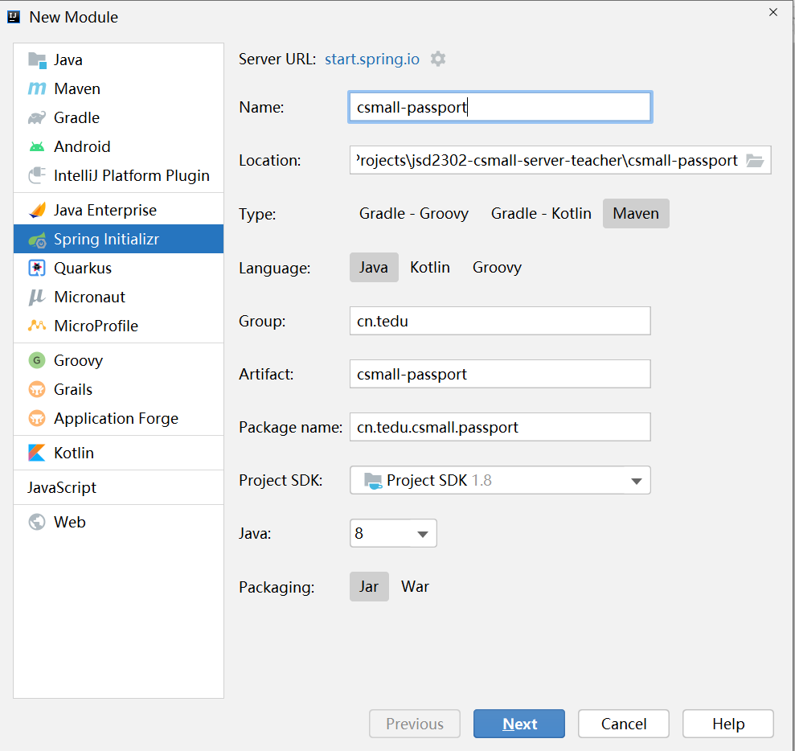
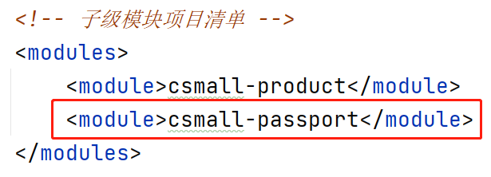

# 管理员数据的数据库设计

## 基于角色的访问控制

RBAC：Role-Based Access Control

为了更加灵活的管理系统中大量用户的访问权限，惯用的做法是使用RBAC模型，涉及的数据表包括：

- 用户信息表：存储用户的基本信息，但不会包含权限等特征
- 角色信息表：声明当前系统中有哪些种角色，例如：超级管理员、普通管理员等，但是，此表并不代码各用户实际可以执行的操作
- 权限信息表：存储权限的信息，即当前系统中有哪些种类的权限，例如：添加用户、删除用户、修改用户密码、发布商品、审核商品等，每一项都是一条权限信息
- 用户与角色的关联表：存储用户与角色的关联
- 角色与权限的关联表：存储角色与权限的关联

使用RBAC模型，可以实现用户与权限的关联的逻辑分离！

# 创建csmall-passport子模块项目

此项目主要实现：添加管理员、显示管理员列表、删除管理员、启用管理员、禁用管理员、管理员登录、管理员登出等。

创建参数如下：



先调整子模块项目的`pom.xml`文件，暂时如下：

```xml
<?xml version="1.0" encoding="UTF-8"?>
<project xmlns="http://maven.apache.org/POM/4.0.0" xmlns:xsi="http://www.w3.org/2001/XMLSchema-instance"
         xsi:schemaLocation="http://maven.apache.org/POM/4.0.0 https://maven.apache.org/xsd/maven-4.0.0.xsd">

    <!-- 模块版本，是相对固定的取值 -->
    <modelVersion>4.0.0</modelVersion>

    <!-- 父级项目 -->
    <parent>
        <groupId>cn.tedu</groupId>
        <artifactId>csmall-server</artifactId>
        <version>0.0.1</version>
        <relativePath/> <!-- lookup parent from repository -->
    </parent>

    <!-- 当前项目的信息 -->
    <groupId>cn.tedu</groupId>
    <artifactId>csmall-passport</artifactId>
    <version>0.0.1</version>

    <!-- 当前项目使用的依赖项 -->
    <dependencies>
    </dependencies>

    <!-- 构建项目的配置 -->
    <!-- 如果此处的配置报错，可以： -->
    <!-- 1. 删除报错的标签，因为，除非你需要将项目打包，否则，可以不需要此处的配置 -->
    <!-- 2. 显式的指定版本号可能可以解决报错的问题 -->
    <build>
        <plugins>
            <plugin>
                <groupId>org.springframework.boot</groupId>
                <artifactId>spring-boot-maven-plugin</artifactId>
            </plugin>
        </plugins>
    </build>

</project>
```

然后，在`csmall-server`父项目的`pom.xml`中，将新的子模块项目配置在子模块清单中：




```
ServiceCode

ServiceException

AdminAddNewParam
	username / password / nickname / avatar / phone / email / description / enable 

IAdminService
	void addNew(AdminAddNewParam adminAddNewParam);

AdminServiceImpl

AdminServiceTests
```


```
JsonResult

Knife4jConfiguration
	修改包名和其它显示字样
	
AdminController

GlobalExceptionHandler
```


