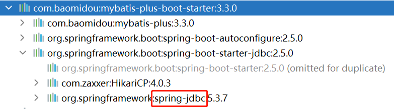

# 基于Spring JDBC框架的事务管理

事务（Transaction）：是数据库中的一种能够保证多个写操作要么全部成功，要么全部失败的机制！

例如以下操作就应该是全部成功或全部失败的，只成功一半，是不可接受的：

```mysql
update 账户表 set 余额=余额-1000 where 帐户名='国斌';
```

```mysql
update 账户表 set 余额=余额+1000 where 帐户名='传奇';
```

在Spring Boot项目中，添加了数据库编程的依赖项后，大多都依赖了`spring-jdbc`框架，例如：



在添加了`spring-jdbc`依赖的项目中，当需要使得某个方法是“事务性”的，只需要使用`@Transactional`注解即可！

关于此注解：

- 添加在业务实现类中的方法上，使得当前方法（重写的方法）是事务性的
- 添加在业务实现类上，使得当前类中所有重写的方法都是事务性的
- 添加在业务接口的抽象方法上，使得重写的方法是事务性的
- 添加在业务接口上，使得实现类中所有重写的方法都是事务性的

**注意：**Spring JDBC框架使用了基于接口的代理来实现事务管理，所有没在接口中声明的方法都不可能是事务性的！

事务的执行过程大致是：

```
开启事务（BEGIN）
执行业务
-- 执行成功，则提交（COMMIT）
-- 执行出错，则回滚（ROLLBACK）
```


